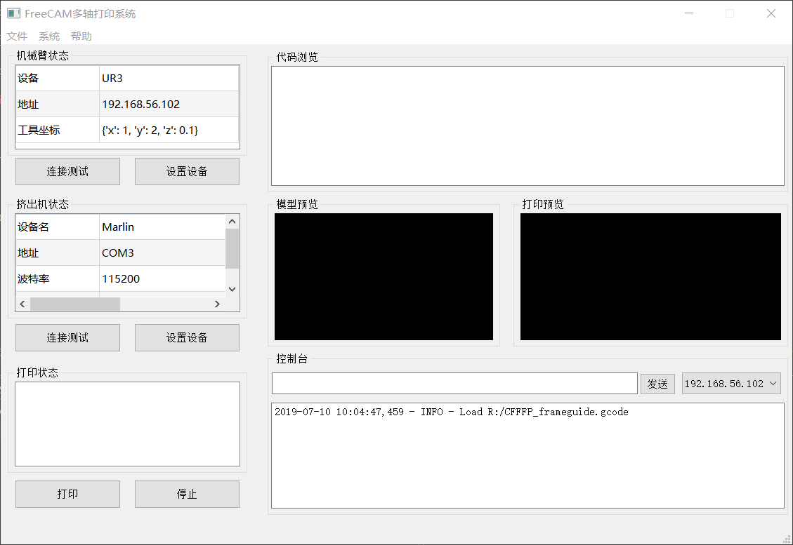

#### Description

FreeCAM为基于机械臂构建的多轴打印提供一个简单的软件实现框架，通过封装和合并机器人控制器和挤出机控制器的操作，实现挤出机与机械臂的同步控制和测试。

#### Framework



* Device
  - Robot
  - Extruder


* CAMData
框架中封装了CAMData模块，完成GCode或空间打印路径规划到的转化和生成.


#### Coding Tips

* UI 设计
```
pip install pyqt5-tools
design UI generate .ui file by [pythonpath]\Lib\site-packages\pyqt5-tools\designer.exe
compile rc and ui
  - pyrcc5 resource.qrc -o resource_rc.py
  - pyuic5 ./**.ui -o ui_**.py
```
设计窗口类包装生成窗体代码，为生成ui添加消息响应函数。
```
class Viewer(Ui_MainWindow):
    def __init__(self):
        super(Ui_MainWindow, self).__init__()
        self.controller = Controller(self)    # 循环引用，注意释放
               
        #self.setupUi(self)
        #self._connect_signals()
    
    def setupUi(self, MainWindow):
        self.MainWindow = MainWindow
        Ui_MainWindow.setupUi(self,MainWindow)      
        ...
```

* 

#### Dependency